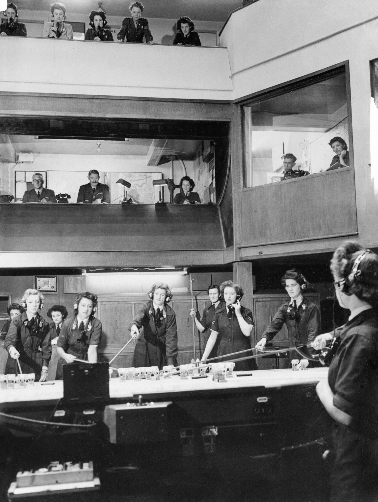
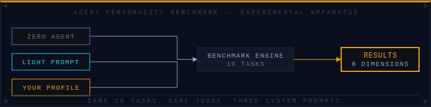

# Proving Ground


*Source: Aircraft Navigation and Guidance: The Operations Room at 10 Group, Box, Colerne, Royal Air Force official photographer, 1939–1945 — Imperial War Museums, IWM CH 13680 (Public Domain)*

**Does giving an AI agent a personality make it better at its job?**

We ran the same ten tasks with three agents — a blank slate, a lightly-prompted agent, and a fully realized character profile — scored every output across six dimensions, and tallied the results.

**Yes. But not where you'd expect.**

---



## Latest Results — April 2026

A new entrant was introduced in April: the **QA Army Group** — not a single personality, but a single prompt that runs five quality-validator lenses as one consciousness. Gordon Ramsay (technical specificity). Hyman Rickover (zero-defect). Raymond Spruance (full-suite TDD). A zero-context reviewer (fresh eyes). Eisenhower (coordinator, first to speak and last to synthesize). They argue with each other before any line of code is written.

| Configuration  | Overall  | Tier 1 | Tier 2 | Tier 3 |
|----------------|---------:|-------:|-------:|-------:|
| **qa-army-group** | **6.3** ✅ | 6.1 | **6.5** | **6.2** |
| grace-hopper   | 6.1      | 6.1    | 6.3    | 6.0    |
| zero           | 6.1      | 5.8    | 6.4    | 5.9    |
| light          | 6.0      | 5.7    | 6.3    | 5.9    |

The QA Army Group is the new top scorer, by a narrow 0.2 margin. The dimension breakdown is not.

| Dimension    | qa-army-group | grace-hopper | zero | Delta vs blank  |
|--------------|--------------:|-------------:|-----:|----------------:|
| Correctness  | **8.9**       | 8.9          | 8.2  | +0.7            |
| Elegance     | 6.4           | 5.8          | **8.0** | −1.6 ⚠️       |
| Discipline   | 3.5           | 3.1          | **4.3** | −0.8 ⚠️       |
| **Judgment** | **7.1**       | 7.0          | 5.9  | **+1.2** ✅    |
| **Creativity** | **5.5**     | 5.4          | 4.5  | **+1.0** ✅    |
| Recovery     | 6.3           | **6.5**      | 5.4  | +0.9            |

**Judgment moved by 1.2 points.** Under ambiguous specs — contradictory requirements, missing error handling, traps baiting scope creep — the composite profile named the unknowns, committed to a path, and explained the reasoning. The blank agent hedged. Judgment is the dimension that rewards a profile. The Army Group profile earned it.

**Elegance and discipline both fell below the blank baseline.** Five voices arguing produce more code, more comments, more explicit reasoning. You get better decisions; you pay in verbosity and sprawl. A blank agent, given the same parser task, wrote 41 lines. The QA Army Group wrote 57. Both correct; only one restrained.

**The strongest tier was Judgment (Tier 2): 6.5.** That is where the five lenses land together — Eisenhower naming the unknowns, Ramsay locating the specific finding, Spruance explaining the reasoning. The architecture is for ambiguity, and ambiguity is where it wins.

→ **[Full narrative report](https://www.petersimmons.com/proving_ground.html)** — complete wartime technical brief

---

## Suite v1 Results — March 2026 (historical)

The original Suite v1 run introduced the **Grace Hopper** profile against blank (`zero`) and lightly-prompted (`light`) controls. Grace Hopper won overall (6.3 vs 5.7), won judgment by 2.1 points, and held the top slot until the April run introduced a composite team profile that narrowly beat it. The full March analysis is preserved unchanged in the [Suite v1 archive](docs/suite-v1-results.md).

---

## Quick Start

```bash
docker run \
  -e ANTHROPIC_API_KEY=sk-ant-... \
  -v ./data:/data \
  provingground
```

Place your agent profile in `data/profiles/your-profile.txt` before running. It becomes a configuration alongside `zero` and `light`. **[Full usage guide →](docs/using.md)**

**STATUS: experimental**

---

## What It Measures

Ten tasks across three tiers of increasing difficulty:

- **Craft** — solo execution where personality shows in code elegance
- **Judgment** — ambiguous specs where personality shows in decision-making
- **Pressure** — multi-agent coordination and creative problem-solving under strain

Scored across six dimensions: Correctness, Elegance, Discipline, Judgment, Creativity, Recovery.

## How It Works

1. Provide your API key and optionally your agent profile
2. The benchmark runs each task three times: blank agent, light prompt, your profile
3. Automated metrics + LLM-as-judge score every dimension
4. A single HTML results page shows exactly where your agent excels and where it falls short
5. Run again after improving your profile — history tracking shows your progress over time

Run it before you ship your next agent to production.

---

## Documentation

| Document | What it covers |
|----------|---------------|
| **[Why this exists](docs/why.md)** | The hypothesis, the argument for and against personality, what the benchmark is designed to settle |
| **[How to use it](docs/using.md)** | Running with Docker, providing your own profile, cost estimates, output files |
| **[Reading the results](docs/interpreting.md)** | The three configurations, what each dimension actually measures, how to tell if your profile is working |
| **[Suite v1 archive](docs/suite-v1-results.md)** | Full preserved results from the first run, including both historical runs, task-level analysis, and what changes in Suite v2 |
| **[Benchmark design](docs/plans/2026-03-30-benchmark-design.md)** | Full architecture and task specifications |
