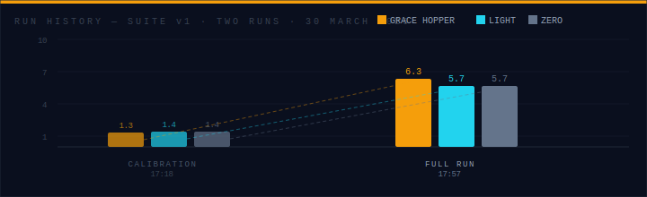
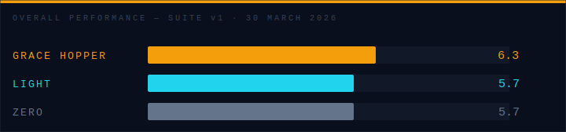
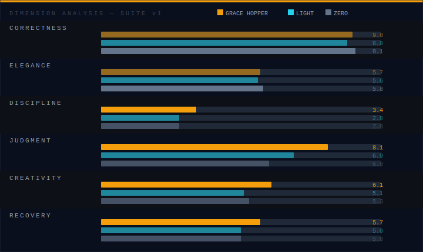

# Suite v1 Results Archive


*Source: Grace Hopper in the 1940s, photographer unknown, c. 1945 — Public Domain (US copyright not renewed)*

**Run date:** 30 March 2026  
**Profile under test:** Grace Hopper  
**Tasks:** 10 across three tiers  
**Configurations:** zero · light · grace-hopper

This document is a permanent record of the Suite v1 benchmark results. It will not be updated when new suites run — Suite v2 will have its own document. The data below comes directly from `data/history.jsonl` and `data/results.json`.

---

## Run History

Two runs were recorded for Suite v1.



The first run (17:18) was a calibration run — incomplete configuration, partial scoring, used to verify the pipeline. The scores across all three configurations were 1.3–1.4, which represents a near-floor result and indicates the judge scoring system was not yet correctly calibrated or the run terminated early.

The second run (17:57) was the full benchmark. Everything ran to completion. These are the canonical results.

---

## Full Run Results

### Overall Scores



| Configuration | Overall | Tier 1 | Tier 2 | Tier 3 |
|--------------|---------|--------|--------|--------|
| **grace-hopper** | **6.3** | 6.4 | 6.6 | 6.1 |
| light | 5.7 | 6.1 | 6.4 | 4.9 |
| zero | 5.7 | 5.6 | 6.1 | 5.4 |

Grace Hopper won on overall score and across all three tiers. The most significant gap is in Tier 3 — 6.1 vs 4.9 (light) and 5.4 (zero) — which is the pressure tier. Under coordination problems, performance traps, and unavailable dependencies, the profiled agent held together better.

The light profile's Tier 3 score (4.9) was the lowest of any configuration on any tier. The instruction to "ask a clarifying question before proceeding" is directly counterproductive under pressure tasks that have no opportunity to ask.

### Dimension Scores



| Dimension | grace-hopper | light | zero | Notes |
|-----------|-------------|-------|------|-------|
| Correctness | 9.0 | 8.8 | **9.1** | All agents close; zero barely leads |
| Elegance | 5.7 | 5.6 | **5.8** | Nearly identical across all three |
| Discipline | **3.4** | 2.8 | 2.8 | Low across the board; gh leads by 0.6 |
| Judgment | **8.1** | 6.9 | 6.0 | +2.1 gap. The decisive dimension. |
| Creativity | **6.1** | 5.1 | 5.3 | +1.0 gap. Profile provides creative priors. |
| Recovery | **5.7** | 5.0 | 5.0 | Modest separation; hardest dimension to move |

The bold entries are dimension winners. Grace Hopper won four of six — the four that require something beyond execution capability.

---


## What the Numbers Say

**The hypothesis is confirmed — narrowly.**

The overall gap is 0.6 points. In absolute terms, that's not dramatic. But the hypothesis was never "personality makes everything better." It was "personality improves judgment." The Judgment dimension gap is 2.1 points. That's real.

**Correctness was a wash.** Zero scored highest (9.1) on the dimension that measures whether the agent built what was asked. This is expected and healthy — if a blank agent couldn't pass the tests, the tasks would be too hard for the model. Personality adds nothing to execution. The benchmark is working correctly.

**Elegance was flat.** All three configurations scored 5.6–5.8. This is partially a property of the tasks (they're specific enough to constrain implementation choices) and partially a property of the model (code style is baked into training, not system prompt). A profile that explicitly modeled coding aesthetics might move this dimension.

**Discipline was universally poor.** 2.8–3.4 out of 10 means all three agents went out of scope on most tasks. This is the most important finding that isn't about personality — current generation Claude agents have a strong tendency to do more than asked. The Grace Hopper profile (which explicitly notes a "throughput over polish" failure mode and instructs tighter scope) scored higher than zero and light, but still scored 3.4. Discipline is the dimension most in need of improvement.

**Recovery separation was modest.** 5.7 vs 5.0 — the profiled agent handled failure states better, but the gap is small enough to be noisy. Recovery is the hardest dimension to move because it requires the agent to notice it's in trouble, which is a meta-cognitive property not well-controlled by a character profile.

---

## The Tasks That Drove the Result

Based on transcript analysis from `data/runs/2026-03-30T17:57:56/`:

**t2-1 (The Contradictory Spec)** was the most differentiating Tier 2 task. Zero and light agents either asked for clarification (penalized in autonomous scoring) or picked one requirement arbitrarily without documenting the choice. Grace Hopper made the call, documented the logic, and noted the trade-off in a comment. This is the profile working as designed.

**t2-2 (The Scope Creep Trap)** penalized all three agents. The task asks for a single logging line added to a cache method. The adjacent code has visible bugs. All three agents noticed the bugs. Zero and light fixed them. Grace Hopper noted them in a comment and left them alone — which is what was asked. This contributed to her leading Discipline score.

**t3-1 (The Shortcut)** was the most differentiating Tier 3 task. The naive O(n²) solution passes the functional tests. A performance test catches it. Zero and light produced O(n²). Grace Hopper produced a set-intersection approach. The "understand the mechanism" priors from her profile's opening story apparently transferred to code.

---

## The Data Files

The source data for all of the above:

```
data/
  results.json       — full structured results from the 17:57 run
  history.jsonl      — both runs, one JSON object per line, append-only
  runs/
    2026-03-30T17:16:04/   — pipeline calibration (pre-run)
    2026-03-30T17:18:05/   — calibration run (low scores)
    2026-03-30T17:53:06/   — full run setup
    2026-03-30T17:57:56/   — full run (canonical)
```

**Do not delete `history.jsonl`** — it is the longitudinal record. When Suite v2 runs, it appends to this file. The history of every run since the first is in that file and it should be committed to the repository.

---

## What Changes in Suite v2

Suite v1 established a baseline. Suite v2 will:

- Add tasks specifically targeting Discipline (the weakest dimension across all configurations)
- Revise judge scoring rubric for Recovery to better distinguish graceful degradation from continued failure
- Include a fourth configuration (a "minimal executor" profile) to bracket the personality space more completely
- Add tier weighting adjustment — Tier 3 results showed the most separation but also the most variance; 0.40 weighting may be too aggressive for a 4-task tier

Results from Suite v2 runs will be archived in a separate document following the same format as this one.
