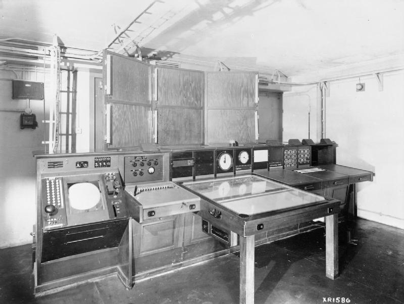
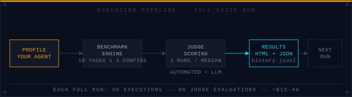

# Using Proving Ground


*Source: Royal Air Force Radar 1939–1945, Mark 3 Console Receiver Room, RAF official photographer, 1939–1945 — Imperial War Museums, IWM CH 15178 (Public Domain)*



## What Do You Need to Get Started?

- **Docker** (or Go if you prefer to build from source)
- **Anthropic API key** with access to Claude
- **Your agent profile** — a `.txt` or `.md` file describing your agent's personality, working style, and known failure modes. This is the variable you're testing. See [interpreting results](interpreting.md) for what makes a good profile.

A full run costs roughly **$15–40** depending on model pricing. Budget accordingly. You can run individual tiers for a cheaper partial result.

---

## How Do You Run It with Docker?

The simplest path:

```bash
docker run \
  -e ANTHROPIC_API_KEY=sk-ant-... \
  -v ./data:/data \
  provingground
```

This runs all ten tasks with all three configurations (zero, light, and any profiles you've placed in `data/profiles/`). When it finishes, open `data/results.html`.

To run a single tier:

```bash
docker run \
  -e ANTHROPIC_API_KEY=sk-ant-... \
  -v ./data:/data \
  provingground --tier 1
```

Tier 1 is the cheapest run (~$4–10) and gives you a quick read on your profile's correctness and elegance characteristics. Tier 2 is where judgment scores appear. Tier 3 is the most expensive and produces the most interesting data.

---

## How Do You Provide Your Own Profile?

Place your profile file in the `data/profiles/` directory before running:

```
data/
  profiles/
    your-profile.txt   ← this file becomes a configuration called "your-profile"
```

The filename (without extension) becomes the configuration label in the results. If you name it `my-agent.txt`, the results will show a `my-agent` column alongside `zero` and `light`.

**Format**: Plain text. No special syntax required. The entire file contents become the system prompt.

**What to include**: This is not a rigid template. Write what you'd actually want an agent to carry into every task. Effective profiles tend to include:

- Perspective on ambiguity (ask, or decide and document?)
- How to handle scope pressure (gold-plating tendency, or tight executor?)
- What the agent values when tradeoffs appear
- Known failure modes and how to compensate for them

The Grace Hopper profile that shipped with Suite v1 is 184 lines covering her life, her work patterns, her philosophy on moving fast versus cleaning up, and specific operational instructions derived from her historical behavior. Most of it is narrative. The narrative is not decoration — it establishes priors that surface when the tasks require judgment.

You don't need 184 lines. But you need more than three sentences.

---

## How Do You Build and Run Without Docker?

```bash
# Build from source
go install github.com/psimmons/proving-ground/cmd/proving-ground@latest

# Or build locally
go build ./cmd/proving-ground

# Run
export ANTHROPIC_API_KEY=sk-ant-...
./proving-ground --tier all --data-dir ./data
```

You'll need Claude Code CLI installed and on your PATH. The benchmark uses it as the execution engine — each task is sent to `claude --print --dangerously-skip-permissions` with the task spec piped via stdin and your profile passed as `--system-prompt`.

---

## What Happens During a Run?

Each task executes independently with each configuration. For a full run with one custom profile, that's 30 executions (10 tasks × 3 configurations). Each execution:

1. Creates an isolated working directory under `data/runs/<timestamp>/<task-id>/<config>/`
2. Launches Claude Code with the task spec
3. Captures the full session transcript and all files written
4. Scores the output: automated metrics first (pytest, LOC, complexity, scope), then LLM-as-judge
5. Judge scoring runs 3 times; median is taken for each dimension to reduce variance

You'll see progress logged to stdout. Expect 45–90 minutes for a full run.

---

## What Files Does It Produce?

After a run, `data/` contains:

| File                   | What it is                                                         |
|------------------------|--------------------------------------------------------------------|
| `results.html`         | Full interactive results page — open this in a browser             |
| `results.json`         | Machine-readable scores in the same structure                      |
| `history.jsonl`        | One line per completed run, all-time — never overwritten           |
| `runs/<timestamp>/`    | Full agent outputs for every task × config pair                    |

**The history file is append-only.** Every run adds a line; nothing is removed. This gives you a longitudinal record as you iterate on your profile.

---

## How Do You Actually Improve Your Profile?

This is what the tool is for. Run the benchmark. Read the results. Find where your profile is weak. Revise. Run again.

That loop is the point. The benchmark gives you a controlled way to test whether a change to your profile made the agent better — or just different. Without a repeatable measurement, you're guessing. With it, you're iterating.

The Judgment and Creativity dimensions respond most visibly to profile changes. Correctness is largely noise — any capable model solves well-specified tasks regardless of what personality you layer on top. Recovery is the hardest to move; it requires the agent to recognize that it's in trouble and adapt mid-task, which is closer to a character property than a learned behavior.

When you find a low dimension score, look at the profile content that addresses that area. If Judgment is low and your profile is thin on decision-making priors, that's the lever. If Discipline is low and your profile is a "thorough engineer" character, that's the profile working as designed — not a defect in the benchmark.

The history file lets you track progress across runs. Don't delete it. Every run is a data point.

---

## Which Tier Should You Run?

| Tier        | Tasks | What it tests                    | Approximate cost |
|-------------|-------|----------------------------------|-----------------|
| `--tier 1`  | 3     | Craft, execution, correctness    | $4–10           |
| `--tier 2`  | 3     | Judgment, ambiguity, scope       | $6–15           |
| `--tier 3`  | 4     | Pressure, coordination, recovery | $8–20           |

Tier 2 is the best single-tier run if you're trying to evaluate whether your profile improves decision-making. Tier 1 results are relatively unsurprising. Tier 3 results are the most interesting and the most expensive.
